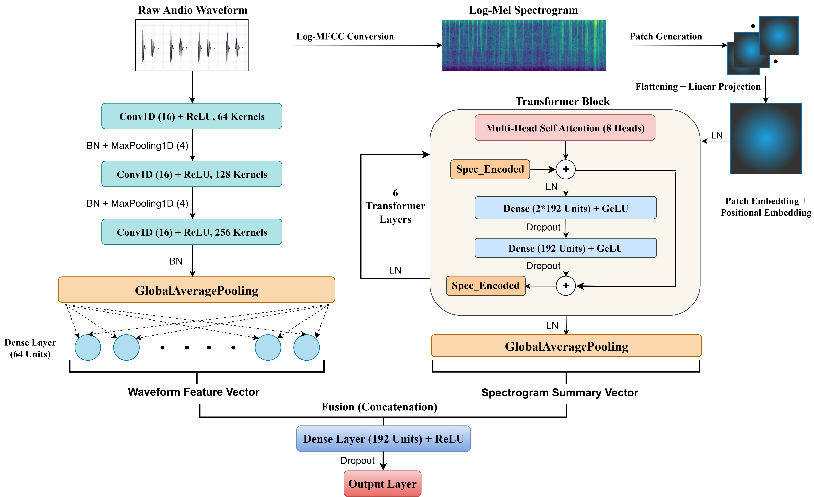

# AudioFuse
AudioFuse: Unified Spectral-Temporal Learning via a Hybrid ViT-1D CNN Architecture for Biomedical Audio Classification

**Official TensorFlow/Keras implementation for the paper: "AudioFuse: Unified Spectral-Temporal Learning via a Hybrid ViT-1D CNN Architecture for Phonocardiogram Classification"**

> **Summary:** The automatic classification of rhythmic biomedical audio, such as phonocardiograms (PCG), requires capturing both spectral (tonal) and temporal (timing) information. Standard methods often rely on a single 2D spectrogram, which excels at revealing spectral features for vision models but inherently compromises the precise temporal information of the original 1D waveform. We propose **AudioFuse**, a lightweight, two-branch architecture designed to simultaneously learn from these complementary representations. To mitigate the overfitting risk common in fusion models, AudioFuse combines a compact Vision Transformer (ViT) for spectrograms with a shallow 1D CNN for waveforms. When trained from scratch on the PhysioNet 2016 dataset, AudioFuse achieves a state-of-the-art competitive ROC-AUC of 0.8608, significantly outperforming its spectrogram-only and waveform-only baselines. Moreover, it demonstrates superior robustness to domain shift on the challenging PASCAL dataset, where the performance of the baseline models degrades significantly. Our results show that the fusion of complementary representations provides a strong inductive bias, enabling the creation of efficient, powerful, and generalizable classifiers for biomedical audio without requiring large-scale pre-training.

---

## Architecture Overview

The AudioFuse model is a two-branch, late-fusion architecture designed to effectively learn from both the spectral and temporal domains of an audio signal. It consists of:

1.  **A Spectrogram ViT Branch:** A custom, wide-and-shallow Vision Transformer (ViT) processes a 2D log-Mel spectrogram, allowing it to learn the global context of harmonic structures and tonal patterns.
2.  **A Waveform 1D-CNN Branch:** A compact, shallow 1D Convolutional Neural Network (CNN) processes the raw 1D audio waveform, identifying precise, timing-based features and transient events.

The final, high-level feature vectors from these two independent "expert" branches are then concatenated and passed to a final MLP head for a robust, unified classification.

 
---

## Key Results

A central finding of this research is that the fusion of complementary spectral and temporal representations leads to a model that is not only higher-performing on in-domain data but is also significantly more robust to domain shift.

#### In-Domain Performance (PhysioNet 2016)
Our fusion model significantly outperforms both of its single-modality components.

| Model | ROC-AUC | MCC | F1 (Abnormal) | Accuracy |
| :--- | :--- | :--- | :--- | :--- |
| Spectrogram Baseline (ViT) | 0.8066 | 0.4444 | 0.7383 | 0.7193 |
| Raw Audio Baseline (1D-CNN) | 0.8223 | 0.4884 | 0.7057 | 0.7376 |
| **AudioFuse (Our Fusion)** | **0.8608** | **0.5508** | **0.7664** | **0.7741** |

#### Domain Generalization (Zero-Shot on PASCAL)
The robustness of the fusion model is most evident when tested on the out-of-domain PASCAL dataset.

| Model | ROC-AUC | Performance Change |
| :--- | :--- | :--- |
| Spectrogram Baseline (ViT) | 0.4873 | **Collapses (-39.6%)** |
| Raw Audio Baseline (1D-CNN) | 0.6782 | Degrades (-17.5%) |
| **AudioFuse (Our Fusion)** | **0.7181** | **Most Robust (-16.6%)** |

The spectrogram-only model fails completely, while the waveform model shows greater robustness. Our AudioFuse model is the most resilient, demonstrating the value of its hybrid design for real-world applications.

---

## Setup and Installation

This project is built using TensorFlow.

**1. Clone the repository:**
```bash
git clone https://github.com/Saiful185/AudioFuse.git
cd AudioFuse
```

**2. Install dependencies:**
It is recommended to use a virtual environment.
```bash
pip install -r requirements.txt
```
Key dependencies include: `tensorflow`, `pandas`, `opencv-python`, `librosa`, `scikit-learn`, `seaborn`.

---

## Dataset Preparation

The experiments are run on four publicly available datasets. For fast I/O, it is highly recommended to download the datasets, zip them, upload the zip file to your Google Drive, and then use the unzipping cells in the Colab notebooks.

#### 1. PhysioNet 2016
- **Download:** From the [Kaggle dataset page](https://www.kaggle.com/datasets/bjoernjostein/physionet-challenge-2016) or the PhysioNet Challenge page.
  
#### 2. PASCAL
- **Download:** From the [Kaggle dataset page](https://www.kaggle.com/datasets/kinguistics/heartbeat-sounds).

## Usage: Running the Experiments

The code is organized into Jupyter/Colab notebooks (`.ipynb`) for each key experiment.

1.  **Open a notebook**.
2.  **Update the paths** in the first few cells to point to your dataset's location (either on Google Drive for unzipping or a local path).
3.  **Run the cells sequentially** to perform data setup, model training, and final evaluation.

---

---

## Pre-trained Models

The pre-trained model weights for our key experiments are available for download from the [v1.0.0 release](https://github.com/Saiful185/AudioFuse/releases/tag/v1.0.0) on this repository.

| Model | Trained On | Description | Download Link |
| :--- | :--- | :--- | :--- |
| **AudioFuse (Fusion)** | PhysioNet | Our main Spectrogram-Waveform fusion model. | [Link](https://github.com/Saiful185/AudioFuse/releases/tag/v1.0.0/best_model_AudioFuse_v1.0.0.keras) |
| **Spectrogram Baseline** | PhysioNet | The ViT baseline model. | [Link](https://github.com/Saiful185/AudioFuse/releases/tag/v1.0.0/best_model_spectrogram_physionet.keras) |
| **Waveform Baseline** | PhysioNet | The 1D-CNN baseline model. | [Link](https://github.com/Saiful185/AudioFuse/releases/tag/v1.0.0/best_model_waveform_baseline.keras) |

## Citation

If you find this work useful in your research, please consider citing our paper:

## License
This project is licensed under the MIT License. See the `LICENSE` file for details.
